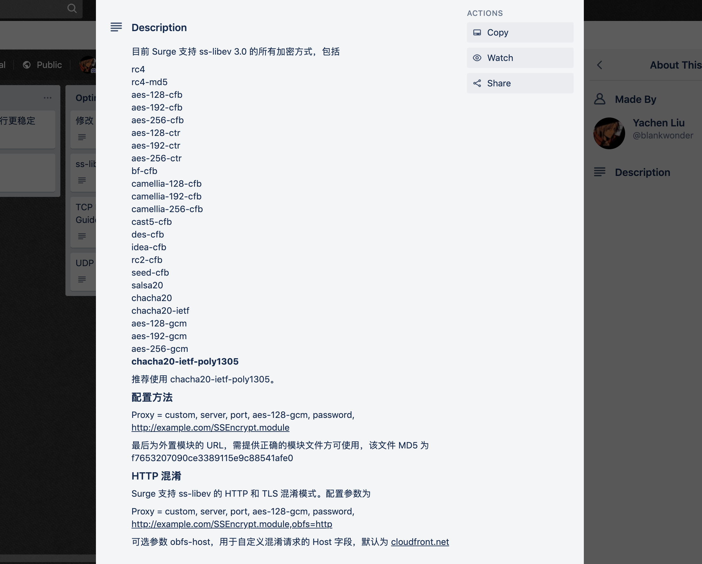

# shadowsucks

Using a so-called shadow sucks.

This is the basic repo for using shadowsocks as a custom proxy for surge.

## How to config surge to use remote shadowsocks server

```
Proxy = custom, server, port, aes-128-gcm, password, http://example.com/SSEncrypt.module
```

Surge 支持 ss-libev 的 HTTP 和 TLS 混淆模式。配置参数为

```
Proxy = custom, server, port, aes-128-gcm, password, http://example.com/SSEncrypt.module,obfs=http
```

可选参数 obfs-host，用于自定义混淆请求的 Host 字段，默认为 cloudfront.net


## the module

the URI: https://raw.githubusercontent.com/peterlikesnoodles/shadowsucks/master/sse.module

MD5: f7653207090ce3389115e9c88541afe0

## source of truth



or, visit this site for detailed information: [trello board](https://trello.com/c/BTr0vG1O/47-ss-libev-%E7%9A%84%E6%94%AF%E6%8C%81%E6%83%85%E5%86%B5)
